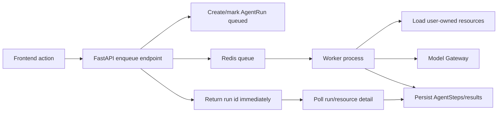

# Design

## Architecture

Use Redis as the queue transport and PostgreSQL as the durable source of truth.

## Queue Runtime Choice

Use `arq` unless implementation proves it incompatible with the local runtime.

Reasons:

- The existing gateway/services are async (`await gateway.chat(...)`).
- Redis is already configured and included in docker-compose.
- Worker functions can stay close to the current service orchestration shape.
- The MVP needs enqueue, worker, retry, timeout, and result observation, not Celery-level routing complexity.

Fallback if `arq` is unsuitable during implementation: implement a tiny Redis Stream worker around the same `queue_runtime` boundary. Do not let workflow services import Redis directly.

## Backend Boundaries

Add a small queue layer under `backend/app/queue/`:

- `runtime.py` — queue client factory, enqueue helper, job id/idempotency helpers.
- `jobs.py` — typed payload models for each workflow.
- `worker.py` — arq worker settings and function registry.
- `handlers.py` or per-workflow modules — worker entry points that open fresh DB sessions and call existing service orchestration.

The API layer only validates user/resource ownership, creates or marks durable records, enqueues a typed job, and returns an immediate response.

The worker layer:

- creates its own `SessionLocal()`;
- constructs its own model gateway via `get_model_gateway()`;
- checks ownership again before doing work;
- updates `AgentRun` state and step trail;
- catches unexpected exceptions and persists failed status.

## State Model

Reuse `AgentRun.status` and extend the allowed lifecycle if needed:

- `queued` — run created and queue message submitted.
- `running` — worker picked up the job.
- `succeeded` — outputs persisted.
- `failed` — terminal failure with sanitized error.
- `cancelled` — optional future state; do not implement cancellation unless naturally cheap.

Existing workflow-specific status blocks should map to this lifecycle:

- Resume facts: `parsed_facts._extraction.status`.
- JD paste parse: `jd_normalized._extraction` or a new parse result envelope tied to `AgentRun`.
- JD analysis: `AgentRun` plus `JobAnalysis` / `GeneratedArtifact` when succeeded.

## API Contract Direction

Use submit/poll contracts:

- Submit endpoint returns `202 Accepted` or `201 Created` with `agent_run` and any immediately available resource shell.
- Poll endpoint returns `AgentRunDetailOut` and resource-specific result when available.
- Existing list/detail endpoints must be enough to hydrate after page reload.

Endpoint compatibility can be phased:

- Keep existing paths if the product flow is already wired, but change their contract intentionally and update frontend/tests together.
- Do not leave a route that looks synchronous but secretly only starts async work without exposing the run id.

## Frontend UX Direction

Build reusable async-run UI patterns:

- Submit button transitions to queued/running state and returns control to the user.
- Page/modal shows status tag, step timeline, elapsed time, and sanitized metadata.
- Polling stops on terminal state.
- Success hydrates the target result automatically.
- Failure shows retry and a link/section for the run trace.

## Migration Order

1. Queue runtime foundation.
2. JD paste parsing, because it is the most obvious user-facing "waiting in modal" pain.
3. Resume fact extraction, replacing temporary `BackgroundTasks`.
4. JD analysis, because it has the richest result hydration and failure visibility.
5. Shared UX cleanup/observability pass to remove duplicated polling and normalize copy.

## Operational Notes

- Docker compose must include a worker service depending on Redis/Postgres.
- Local development must document a command such as `cd backend && arq app.queue.worker.WorkerSettings`.
- Worker tests should run with fake model gateway and either fake Redis/queue adapter or a controlled local Redis path.
- Queue failures must not orphan runs in `queued/running`; handlers need terminal failure guards.
