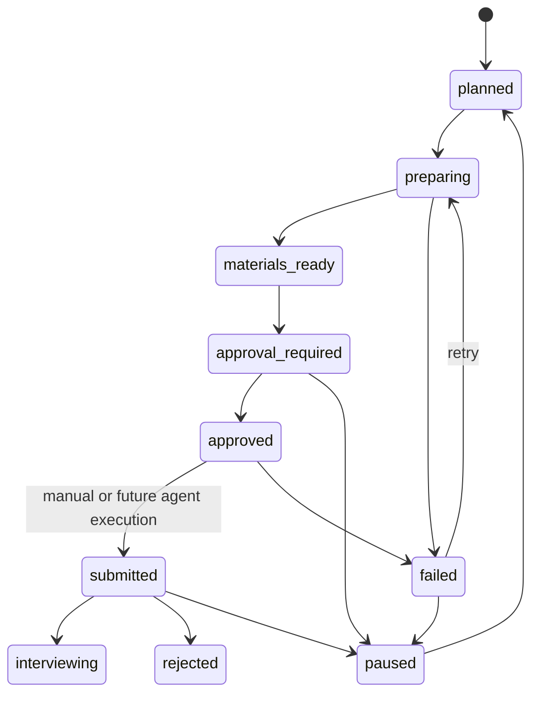

# Design

## Core Principle

Application automation should be built on an operation ledger, not on direct
button-click automation. The product should first know what it intends to do,
why, with which sources, under whose approval, and how to recover if it fails.

## Architecture Overview

```text
Job + Resume + Profile
  -> JD Analysis
  -> Application Readiness Package
  -> Application Record State Machine
  -> User Approval Boundary
  -> Future Platform Action
```

Existing internal async pattern remains the foundation:

```text
Frontend action
  -> FastAPI submit endpoint
  -> create durable AgentRun / Application timeline event
  -> enqueue worker job
  -> worker generates artifact or failure result
  -> frontend polls ApplicationRecord + AgentRun detail
```

## Proposed Domain Objects

### ApplicationRecord

The existing model can be extended conservatively instead of replaced.

Initial fields to consider:

- `id`
- `user_id`
- `job_id`
- `resume_version_id`
- `status`
- `timeline`
- `readiness_snapshot`
- `latest_agent_run_id`
- `latest_error`
- `approved_action_id`

Keep `timeline` as JSON for MVP if migration scope must stay small, but the
design should not assume JSON timeline is permanent. A normalized
`application_events` table becomes valuable before platform automation.

### GeneratedArtifact

Use the existing table for application materials:

- `hr_opening_message`
- `resume_rewrite_snippet`
- `skill_gap_plan`
- `interview_prep`

Every artifact should include:

- `user_id`
- `job_id`
- `resume_version_id`
- `agent_run_id`
- `prompt_version`
- `model_name`
- `source_ids`
- validated content.

### ApplicationAction (Future)

Before external automation, add an explicit action concept. It can start as a
JSON object inside timeline, then graduate to a table.

Required shape:

```json
{
  "id": "action_id",
  "type": "platform_submit | hr_message | upload_resume",
  "status": "draft | approval_required | approved | running | succeeded | failed | unknown",
  "idempotency_key": "stable-key",
  "payload_preview": {},
  "approval": {
    "approved_by": "user_id",
    "approved_at": "timestamp",
    "approved_payload_hash": "hash"
  },
  "external_result": {},
  "error": {}
}
```

## State Machine



### State Rules

- `preparing` requires an active AgentRun or a clear queued operation.
- `materials_ready` requires current artifacts for the selected job/resume
  source set.
- `approval_required` means an external action payload can be previewed.
- `approved` must bind to a hash/snapshot of the exact action payload.
- If job, resume, or profile changes after approval, approval should become
  stale and return to `approval_required`.
- `submitted` should only be set by explicit manual confirmation or a completed
  audited external action.

## Failure Model

### Failure Envelope

Every failed readiness operation should be renderable from a common shape:

```json
{
  "category": "queue | model | validation | data | user_action | platform | unknown",
  "code": "stable_error_code",
  "message": "safe user-facing message",
  "retryable": true,
  "next_action": "retry | edit_source | choose_resume | reapprove | manual_review",
  "agent_run_id": "run_id",
  "source_ids": {},
  "occurred_at": "timestamp"
}
```

Do not store raw resume text, raw prompts, or secrets in failure envelopes.

### Error Matrix

| Failure | Status | Retry | User Action |
| --- | --- | --- | --- |
| Queue enqueue failed | `failed` | yes | retry generation |
| Worker timeout | `failed` | yes | retry, maybe shorter input |
| Model invalid JSON | `failed` | yes | retry or adjust prompt |
| Schema validation failed | `failed` | yes | retry after prompt/schema review |
| Resume has no text | `failed` | no | upload parseable resume |
| Source changed after generation | `materials_ready` + stale flag | yes | regenerate |
| Duplicate active run | keep current status | no | show active run |
| User paused | `paused` | no automatic retry | resume manually |
| Approval stale | `approval_required` | yes | reapprove updated payload |
| Platform login expired | future `failed` | yes | re-login |
| CAPTCHA encountered | future `approval_required` or `paused` | no auto | user handles challenge |
| Unknown submit result | future `unknown` | manual reconciliation | inspect platform |

## Idempotency Strategy

Internal generation idempotency keys:

```text
artifact:<artifact_type>:<job_id>:<resume_version_id>:<source_hash>
application-readiness:<application_id>:<operation_type>:<source_hash>
```

Future external action idempotency keys:

```text
platform-submit:<platform>:<user_id>:<job_external_id>:<resume_version_id>:<payload_hash>
hr-message:<platform>:<user_id>:<conversation_id>:<payload_hash>
```

The idempotency key must be stored before execution starts.

## Readiness Package Freshness

Each readiness package should carry a `source_hash` made from:

- job id + updated_at + normalized JD fields;
- resume version id;
- profile updated_at;
- prompt version(s).

If any source changes, existing artifacts remain visible but become stale. The
UI should say "可参考，但建议重新生成" rather than hiding them.

## User Approval Boundary

Approval is not a boolean checkbox. It is approval of a specific payload.

Approval record must include:

- user id;
- timestamp;
- action type;
- payload preview;
- payload hash;
- source ids;
- expiration/staleness rule.

If the payload changes, approval is invalid.

## Automatic Application Agent Gate

After this loop is implemented, the first automation agent can start only if:

1. Application records and timeline events are reliable.
2. Failed internal runs have user-visible recovery paths.
3. Materials can be generated, regenerated, and marked stale.
4. Approval can bind to exact action payloads.
5. External action idempotency and audit contracts are implemented.
6. One platform is selected for a constrained pilot.
7. The pilot is dry-run capable: it can navigate/fill/preview without submit.

## Recommended First Platform Automation Shape

Start with a "guided submit" agent:

- agent opens or navigates target platform;
- checks login/session;
- fills fields using approved readiness package;
- uploads or prepares resume file only after user approval;
- stops at final submit page;
- user confirms;
- agent records result or unknown state.

Avoid autonomous bulk apply until several pilot runs have clean audit trails and
known failure recovery.

