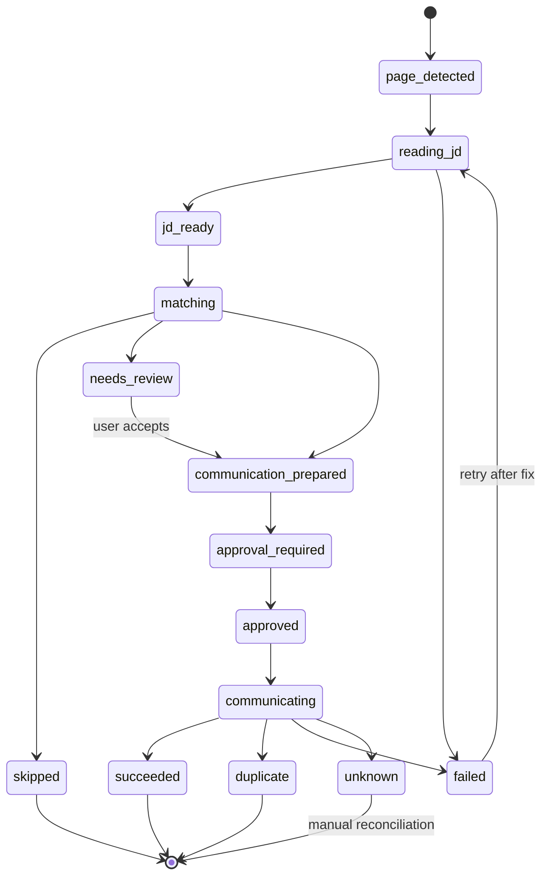

# Design: BOSS 推荐职位 JD 读取与自动沟通 Agent

## Core Decision

使用 **backend agent + userscript executor**，不使用纯 Tampermonkey 自动投递。

```text
Backend agent:
  decides what to read, how to parse, whether to communicate, what to say,
  whether approval/idempotency permits a side effect, and how to record failures.

Userscript:
  executes bounded page-local instructions on the current BOSS page,
  returns scoped/sanitized observations, and never owns business policy.
```

这样做牺牲了一点实现速度，换来审计、幂等、失败恢复、多平台抽象和安全边界。

## Target MVP Flow

第一阶段只做一个职位闭环，不做推荐列表大循环：

```text
User opens BOSS recommended job / job detail page
  -> userscript heartbeat with page_id + url_hash + title
  -> backend starts "inspect current BOSS job" run
  -> backend sends read_jd(page binding)
  -> userscript reads scoped JD fields
  -> backend parses/analyzes JD and creates/updates Job + ApplicationRecord
  -> backend match decision
      skip          -> record skipped reason, no browser side effect
      needs_review  -> record review-required action, wait for user
      communicate   -> create action draft with opening_message
  -> approval/idempotency gate
  -> backend sends click/fill/send instructions
  -> userscript executes exactly bounded actions
  -> backend reads result marker
  -> action/application timeline reaches succeeded, duplicate, failed, or unknown
```

## Architecture

```text
Frontend
  GuidedSubmitPanel / Future RecommendedJobPilotPanel
    - bridge status
    - current JD preview
    - match decision
    - opening message preview
    - approve/execute controls
    - failure recovery UI

Backend API
  POST /boss/recommended-jobs/current/inspect
  POST /boss/recommended-jobs/{application_id}/communicate/prepare
  POST /boss/recommended-jobs/{application_id}/communicate/execute
  GET  /userscript-bridge/status
  GET  /userscript-bridge/next-instruction
  POST /userscript-bridge/result
  POST /userscript-bridge/heartbeat

Backend Services
  BOSSRecommendedJobService
    - page binding checks
    - read_jd orchestration
    - job/application upsert
    - match decision
    - action draft / approval / idempotency
    - failure envelope mapping

Platform Adapter
  UserscriptBossAdapter
    - read_current_jd()
    - prepare_communication()
    - execute_communication()
    - classify_communication_result()

Userscript Bridge
  UserscriptChannel
    - process-local instruction queue
    - page/session binding
    - result correlation
    - heartbeat liveness

Tampermonkey Script
    - read_jd
    - click_immediate_communicate
    - fill_opening_message
    - send_opening_message
    - read_communication_result
```

## Why The Agent Should Not Live In Tampermonkey

### Pure Tampermonkey Looks Simple

```text
read DOM -> keyword match -> click immediately -> fill static template -> next job
```

This is tempting, but it would move core product behavior into a script running
inside a third-party website.

### Problems It Creates

| Problem | Pure userscript risk | Backend-agent bridge answer |
| --- | --- | --- |
| Audit | Hard to know why a job was contacted | AgentRun + timeline + decision trace |
| Idempotency | Refresh/multi-tab can double-send | backend idempotency key before click |
| Approval | Payload can change after user review | approval binds exact payload hash |
| Safety | Resume/profile/prompt exposed to page script | userscript sees only operation payload |
| Failure | Unknown send state may continue looping | stable failure envelope + hard stop |
| Testing | Browser script logic is hard to unit test | backend services/adapters are testable |
| Multi-platform | Logic becomes BOSS-specific | service + adapter protocol can extend |

### Final Boundary

- **Backend owns** matching, prompt use, opening-message generation, action
  approval, idempotency, audit, retries, state transitions and platform failure
  classification.
- **Userscript owns** DOM access and bounded page actions only.

## Data Contracts

### Bridge Instruction: `read_jd`

```json
{
  "instruction_id": "uuid",
  "op": "read_jd",
  "page_id": "boss-page-session-id",
  "expected_url_hash": "sha256:abcd1234",
  "max_text_chars": 8000,
  "selector_profile": "boss_recommended_job_v1"
}
```

### Bridge Result: `read_jd`

```json
{
  "instruction_id": "uuid",
  "page_id": "boss-page-session-id",
  "success": true,
  "jd": {
    "title": "后端工程师",
    "company": "某公司",
    "location": "上海",
    "salary": "20-35K",
    "experience": "3-5年",
    "education": "本科",
    "skills": ["Python", "FastAPI"],
    "description": "职位正文，长度受限，已清洗",
    "source_kind": "boss_recommended_job",
    "page_url_hash": "sha256:abcd1234"
  },
  "error": null
}
```

Rules:

- `description` is page text, not raw HTML.
- The userscript must strip obvious secrets before returning.
- The backend sanitizes and validates again.
- The bridge queue still does not persist the result; persistence happens only
  after service-layer validation.

### Match Decision

```json
{
  "decision": "communicate",
  "score": 0.82,
  "reasons": ["技术栈匹配", "城市匹配"],
  "risks": ["薪资上限未知"],
  "missing_requirements": [],
  "opening_message": "您好，我对这个岗位很感兴趣..."
}
```

Allowed `decision` values:

- `communicate`: eligible to prepare a platform action.
- `skip`: record reason and stop.
- `needs_review`: show user review UI and stop before browser side effect.

### Communication Action

```json
{
  "type": "boss_immediate_communicate",
  "status": "draft | approval_required | approved | running | succeeded | duplicate | failed | unknown",
  "application_id": "uuid",
  "platform": "boss",
  "job_url_hash": "sha256:abcd1234",
  "resume_version_id": "uuid",
  "payload_preview": {
    "opening_message": "您好..."
  },
  "payload_hash": "sha256:...",
  "idempotency_key": "boss:communicate:<user_id>:<job_url_hash>:<resume_version_id>:<payload_hash>",
  "decision_trace": {},
  "external_result": {}
}
```

## Page Binding

The bridge must prevent wrong-tab execution.

Minimum viable rule:

- heartbeat includes `page_id`, `page_url_hash`, `page_title`;
- backend chooses one active `page_id`;
- every instruction includes `page_id` and `expected_url_hash`;
- userscript only executes when both match current page state;
- result includes the same `page_id`;
- backend rejects mismatched results.

If page hash changes between `read_jd` and `send_opening_message`, the action
becomes stale and must be re-prepared.

## State Machine



## Failure Matrix

| Code | Category | Retry | Next action | Browser side effect allowed |
| --- | --- | --- | --- | --- |
| `bridge_not_connected` | platform | yes | refresh BOSS page / start backend | no |
| `page_binding_mismatch` | safety | no | choose active tab again | no |
| `boss_login_required` | platform | yes | user logs in | no |
| `boss_captcha_required` | platform | no auto | user solves challenge | no |
| `boss_rate_limited` | platform | no auto | wait / manual review | no |
| `jd_read_failed` | platform | yes | retry after page refresh | no |
| `jd_too_sparse` | data | no auto | manual review or skip | no |
| `match_below_threshold` | product | no | skip | no |
| `match_needs_review` | product | no auto | user reviews | no |
| `opening_message_invalid` | validation | yes | regenerate / edit prompt | no |
| `approval_stale` | safety | yes | reapprove exact payload | no |
| `duplicate_communication` | idempotency | no | mark duplicate | no |
| `immediate_button_missing` | selector | no auto | selector update/manual | no |
| `message_input_missing` | selector | no auto | selector update/manual | no |
| `send_result_unknown` | platform | no auto | manual reconciliation | no further click |

## Safety Invariants

- No instruction may click unless a backend action is already approved or
  explicitly configured for dry-run/test mode.
- `read_jd` is the only raw page text exception; raw HTML remains forbidden.
- The userscript cannot initiate loops or actions by itself.
- A single external communication action may click at most:
  - one `click_immediate_communicate`;
  - one `send_opening_message`.
- Unknown result never triggers automatic retry.
- All records are user-scoped; cross-user access returns 404.

## Rollout Plan

1. Implement `read_jd` only and validate page binding.
2. Persist/associate JD with internal job/application record.
3. Add backend match decision with fake/model-backed tests.
4. Add action draft + approval/idempotency gate.
5. Add click/fill/send instructions, still behind manual approval by default.
6. Run at least 10 real dry-runs without wrong-tab, duplicate, or unknown send
   incidents before enabling any auto-execute flag.
7. Only after this task is stable, start the larger recommended-job loop.
